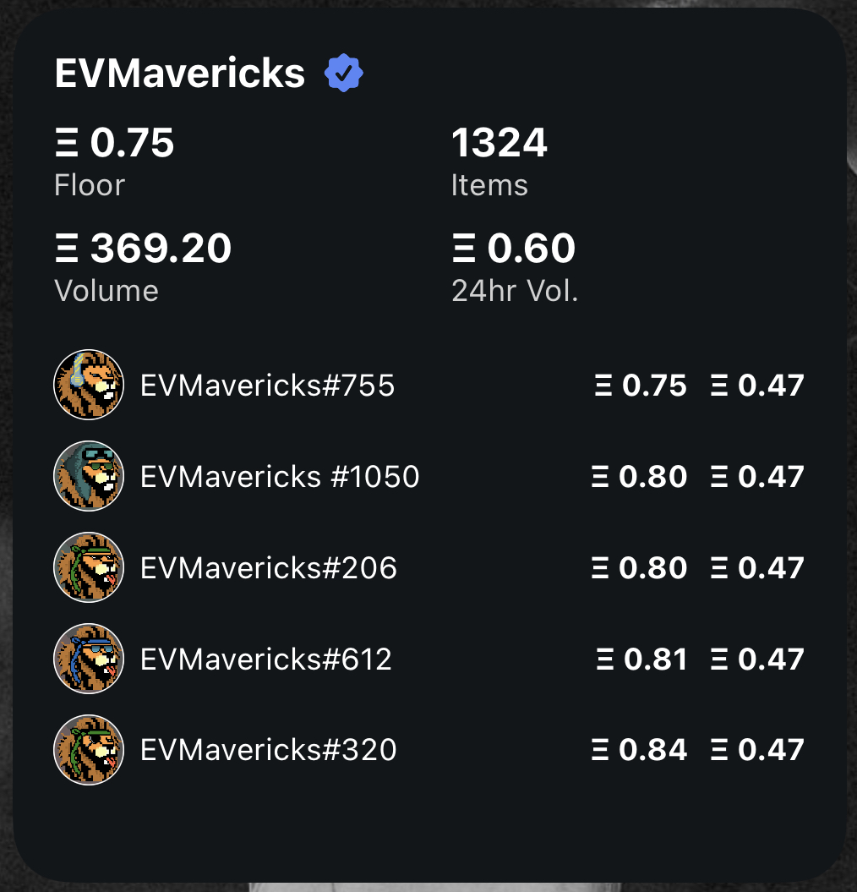

# LooksRare Collection Widget

This is a widget for [Scriptable](https://scriptable.app) which shows the current floor, volume and top – medium and large widgets – 3 (4 on large widget) NFTs in the collection. This script makes use of LooksRare's public API and also their graphql endpoint which is undocumented and could stop working unexpectedly. I had to make use of this as you cannot get a list of tokens from their public API as it currently stands.



All feedback is welcome on this!

## Usage

1. Make sure to firstly install the Scriptable app on your iOS device
1. Copy the contents of LooksRareCollection.js into a new script in Scriptable
1. Add the widget of your chosen size to your iOS device
1. Edit the widget (long touch on it) and under Parameter enter the config variables (see below) as correctly formatted JSON

### Config

The config object is a plain JSON object and currently only has one parameter `"collection"` which is the address for the NFT collection you are interested in:

```
{"collection":"0x7dDAA898D33D7aB252Ea5F89f96717c47B2fEE6e"}
```

The collection here is for the [EVMavericks](https://looksrare.org/collections/0x7dDAA898D33D7aB252Ea5F89f96717c47B2fEE6e) collection which is what inspired my interest in building this!

## RoadMap

When I have time, and if this script gets used by anyone I have a few ideas in mind for improvements:

- [] Add a config variable for the sort order of the tokens shown in the widget
- [] Add light mode support for the widget
- [] Add support for other NFT platforms (bit unsure on this one, will depend on interest)
- [] Adding other scripts, or other config options, for example to focus on the user's own token(s)
  
